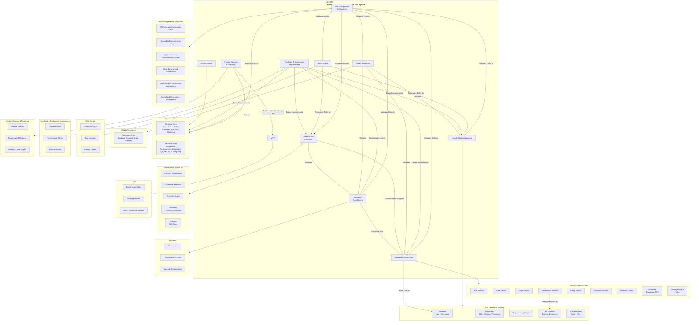

# Unified Crew Operations Digital Twin System(UCODTS)
A fully integrated, AI-driven platform—that synchronizes real-time airline data across crew, flight operations, engineering, safety, and network operations into one seamless, predictive, and proactive management system.

## Vision & Mission
**Vision:**  
"To revolutionize airline operations by creating a fully integrated digital twin that delivers real‑time insights, predictive analytics, and proactive decision‑making—ensuring optimal crew performance, enhanced safety, and superior operational efficiency."

**Mission:**  
UCODTS aims to build a robust, scalable, and secure platform that:
- Unifies fragmented operational data into a single source of truth.
- Leverages AI/ML and IoT to predict disruptions and optimize resource allocation.
- Empowers stakeholders with real‑time dashboards and actionable insights.
- Complies with the highest industry standards for safety, security, and regulatory compliance.

## Key Features
- **Integrated Operations Dashboard:** Real‑time visualization of crew schedules, flight statuses, maintenance alerts, and safety incidents.
- **Predictive Analytics:** Advanced AI/ML models to forecast crew fatigue, predict maintenance needs, and preemptively manage disruptions.
- **Data Unification:** Aggregation of diverse data sources (IoT sensors, external APIs, legacy systems) into one cohesive system.
- **Scalability & Resilience:** Cloud‑native microservices architecture orchestrated via Kubernetes and provisioned with Terraform.
- **Comprehensive Testing & Security:** End‑to‑end automated tests, robust API security, and continuous monitoring.

## Architecture Overview
UCODTS is built on a modular microservices architecture that integrates:
- **Frontend:** A Next.js application providing an intuitive dashboard.
- **Backend:** Multiple microservices for authentication, crew scheduling, flight tracking, maintenance, safety, and disruption management.
- **Data & ML:** Data ingestion pipelines, preprocessing scripts, and machine learning pipelines that ensure high‑quality analytics and predictive modeling.
- **Infrastructure:** Containerization (Docker), orchestration (Kubernetes), and cloud provisioning (Terraform) backed by robust monitoring (Prometheus, Grafana) and logging (ELK).

