# Unified Crew Operations Digital Twin System(UCODTS)
A fully integrated, AI-driven platform—that synchronizes real-time airline data across crew, flight operations, engineering, safety and network operations into one seamless, predictive, and proactive management system.

## Vision & Mission
**Vision:**  
"To revolutionize airline operations by creating a fully integrated digital twin that delivers real‑time insights, predictive analytics, and proactive decision‑making—ensuring optimal crew performance, enhanced safety, and superior operational efficiency."

**Mission:**  
UCODTS aims to build a robust, scalable, and secure platform that:
- Unifies fragmented operational data into a single source of truth
- Leverages AI/ML and IoT to predict disruptions and optimize resource allocation
- Empowers stakeholders with real‑time dashboards and actionable insights
- Complies with the highest industry standards for safety, security and regulatory compliance

## Key Features
- **Integrated Operations Dashboard:** Real‑time visualization of crew schedules, flight statuses, maintenance alerts and safety incidents.
- **Predictive Analytics:** Advanced AI/ML models to forecast crew fatigue, predict maintenance needs, and preemptively manage disruptions.
- **Data Unification:** Aggregation of diverse data sources (IoT sensors, external APIs, legacy systems) into one cohesive system.
- **Scalability & Resilience:** Cloud‑native microservices architecture orchestrated via Kubernetes and provisioned with Terraform.
- **Comprehensive Testing & Security:** End‑to‑end automated tests, robust API security, and continuous monitoring.

## Architecture Overview
UCODTS is built on a modular microservices architecture that integrates:
- **Frontend:** A Next.js application providing an intuitive dashboard.
- **Backend:** Multiple microservices for authentication, crew scheduling, flight tracking, maintenance, safety, sustainability and disruption management.
- **Data & ML:** Data ingestion pipelines, preprocessing scripts and machine learning pipelines that ensure high‑quality analytics and predictive modeling.
- **Infrastructure:** Containerization (Docker), orchestration (Kubernetes), and cloud provisioning (Terraform) backed by robust monitoring (Prometheus, Grafana) and logging (ELK).

[Roadmap](https://github.com/suprachakra/Unified-Crew-Operations-Digital-Twin-System-UCODTS-/blob/main/docs/Strategy/05_Roadmap_and_Milestones.md#roadmap-and-milestones)


### Directory Snapshot
```bash
├── backend 
│   ├──database/
│   ├──message_queue/
│   ├──services/
│      ├──auth/                              # User authentication and authorization using JWT and OAuth standards
│	     ├──common/                            # Shared utilities, configuration settings, and constants used across multiple backend services
│	     ├──compliance/                        # Crew schedules against multi-region regulatory requirements(flight time limitations, rest period checks, and custom business rules)
│	     ├──crew-management/                   # Fatigue mgmt, Crew scheduling
│	     ├──flight-tracking/                   # Real-time flight position tracking, distress monitoring, and alert generation
│	     ├──maintenanace/                      # Predictive maintenance
│	     ├──safety/                            # Monitors safety incidents and manages incident reporting for regulatory compliance
│	     ├──sustainability/                    # Tracks flight emissions and fuel efficiency metrics
├── data/
├── docs/
│   ├── Strategy/
│   │   ├──Executive Summary and Vsion       # Problem Statement, Vision, Mission, Strategic Imperatives
│	  │   ├──Market and User Insights          # Market research, User personas, Competititve Analysis, Revenue Models
│	  │   ├──OKRs                              # Strategic OKRs
│	  │   ├──Product Strategy                  # Product Positioning, Value Proposition, Market positioning, GTM Strategy
│	  │   ├──Roadmap                           # 18 month roadmap(Sprint Goals, Success Metric, SAFe milestones, Deliverables)
│  	│   ├──Launch Strategy                   # MVP and full scale launches
│   ├── Technical/
│       ├──Architecture                      # Architectural componenets, Diagrams
│	      ├──Epics and Strategic Alignement    # Epics and OKR alignemnts
│	      ├──Requirements_FRs_NFRs             # Requirements, Acceptance critieria, Risks and Mitigations
│	      ├──AI Model                          # Architecture, Training Data, MLOps Pipeline
│	      ├──Security_Devops_QA                # Security Architecture, Disaster Recovery, CI/CD Pipepline, IaC, Testing Strategy
│	      ├──API Documentation                 # Endpoints
├── frontend/                                # Components, pages, Dasboards for Web portal & mobile app (React, React Native)
├── infrastructure/                          # Terraform, Kubernetes, Monitoring, CI/CD pipelines
├── scripts/                                 # Local setup, DB backups, testing, linting
├── test/                                    # Test Cases for BE, FE, Data and security

```
---

```mermaid
flowchart TD
 subgraph MAIN["UCODTS<br><b>Unified Crew &amp; Operations Digital Twin System</b>"]
        DOC["Documentation"]
        FE["Frontend<br>React/Next.js"]
        BE["Backend Microservices"]
        DML["Data & Machine Learning"]
        INF["Infrastructure<br>&amp; DevOps"]
        QA["Quality Assurance"]
        UTIL["Utility Scripts"]
        FB["Feedback & Continuous Improvement"]
        RM["Risk Management<br>&amp; Mitigations"]
        PS["Product Strategy<br>&amp; Roadmap"]
        MVP["MVP"]
  end
 subgraph DOC_SUB["Documentation"]
        DOC1["Strategy Docs<br>Vision, Market, OKRs, Roadmap, MVP, Risk, Marketing"]
        DOC2["Technical Docs<br>Architecture, Requirements, Integration, QA, API, UX, Change Log"]
  end
 subgraph FE_SUB["Frontend"]
        FE1["Public Assets"]
        FE2["Components & Pages"]
        FE3["Styles & Configurations"]
  end
 subgraph BE_SUB["Backend Microservices"]
        BE1["Auth<br> Service"]
        BE2["Crew Management<br> Service"]
        BE3["Flight<br> Service"]
        BE4["Maintenance<br> Service"]
        BE5["Safety<br>Service"]
        BE6["Disruption<br>ervice"]
        BE7["Common<br> Utilities"]
        BE8["Database<br>Migrations, ORM, ,<br>Data Sync"]
        BE9["Message Queue<br>Kafka"]
        BE10["Sustainability"]
  end
 subgraph DML_SUB["Data & Machine Learning"]
        DML1["Datasets<br>Raw &amp; Processed"]
        DML2["Notebooks<br>EDA, Cleaning, Prototyping"]
        DML3["Preprocessing<br> Scripts"]
        DML4["ML Pipeline<br>Training &amp; Inference"]
        DML5["Trained Models<br>Binary Files"]
  end
 subgraph INF_SUB["Infrastructure & DevOps"]
        INF1["Docker Configurations"]
        INF2["Kubernetes Manifests"]
        INF3["Terraform Scripts"]
        INF4["Monitoring<br>Prometheus, Grafana"]
        INF5["Logging<br>ELK Stack"]
  end
 subgraph QA_SUB["Quality Assurance"]
        QA1["Automated Tests<br>Backend, Frontend, Data, Security"]
  end
 subgraph UTIL_SUB["Utility Scripts"]
        UTIL1["Monitoring<br> Setup"]
        UTIL2["Data<br> Migration"]
        UTIL3["General<br> Utilities"]
  end
 subgraph FB_SUB["Feedback & Continuous Improvement"]
        FB1["User<br> Feedback"]
        FB2["Performance<br> Metrics"]
        FB3["Security<br> Audits"]
  end
 subgraph RM_SUB["Risk Management<br> &amp; Mitigations"]
        RM1["API Contracts<br> &amp; Integration Tests"]
        RM2["Scalability Testing<br> &amp; Auto-scaling"]
        RM3["Agile Practices<br> &amp; Documentation Audits"]
        RM4["Clear Ownership<br> &amp; Governance"]
        RM5["Automated CI/CD<br> &amp; Config Management"]
        RM6["Centralized Dependency<br> Management"]
  end
 subgraph PS_SUB["Product Strategy & Roadmap"]
        PS1["Vision & Mission"]
        PS2["Roadmap & Milestones"]
        PS3["Market & User Insights"]
  end
 subgraph MVP_SUB["MVP"]
        MVP1["Core Functionalities"]
        MVP2["Pilot Deployment"]
        MVP3["User Feedback & Iteration"]
  end
 subgraph API["API Gateway & Security"]
        GW["API Gateway<br>(WAF, Rate‑Limit)"]
        ID["Identity &amp; Auth<br>(OAuth2 / JWT / SSO)"]
        MESH["Service Mesh<br>(mTLS, Circuit Breakers)"]
  end
 subgraph OBS["Observability"]
        MET["Metrics<br> (Prometheus)"]
        LOG["Logs<br> (ELK / Fluentd)"]
        TRACE["Tracing<br> (Jaeger)"]
        ALERT["Alert Rules / SLOs"]
  end
    DOC --> DOC_SUB
    FE --> FE_SUB
    BE --> BE_SUB & OBS
    DML --> DML_SUB
    INF --> INF_SUB
    QA --> QA_SUB
    UTIL --> UTIL_SUB
    FB --> FB_SUB
    RM --> RM_SUB
    PS --> PS_SUB
    MVP --> MVP_SUB
    FE -- Consumes APIs --> BE
    BE -- Stores Data in --> DML1
    BE4 -- Feeds predictions to --> DML4
    INF -- Orchestrates & Supports --> BE
    INF -- Supports --> FE
    QA -- Validates --> BE & FE & DML
    FB -- Drives Improvements --> DOC_SUB & FE & BE & DML & INF
    UTIL -- Automates Tasks for --> INF & DML
    RM -- Mitigates Risks in --> DOC_SUB & FE & BE & DML & INF & QA & UTIL
    PS -- Guides vision & roadmap for --> MVP
    PS -- Informs --> DOC_SUB
    API --> BE

     FE:::DegasGreen
     BE:::Rose
     DML:::KlimtGold
     UTIL:::Peach
     RM:::Pine
     DOC1:::VanGoghYellow
     DOC2:::VanGoghYellow
     FE1:::DegasGreen
     FE2:::DegasGreen
     FE3:::DegasGreen
     BE1:::RenoirPink
     BE1:::Rose
     BE2:::Rose
     BE3:::Rose
     BE4:::Rose
     BE5:::Rose
     BE6:::Rose
     BE7:::Rose
     BE8:::Rose
     BE9:::Rose
     BE10:::Rose
     DML1:::KlimtGold
     DML2:::KlimtGold
     DML3:::KlimtGold
     DML4:::KlimtGold
     DML5:::KlimtGold
     INF1:::MatisseLavender
     INF2:::MatisseLavender
     INF3:::MatisseLavender
     INF4:::MatisseLavender
     INF5:::MatisseLavender
     QA1:::CezannePeach
     UTIL1:::DegasGreen
     UTIL2:::DegasGreen
     UTIL3:::HokusaiWave
     UTIL3:::DegasGreen
     FB1:::Peach
     FB2:::Peach
     FB3:::Peach
     RM1:::MonetBlue
     RM2:::MonetBlue
     RM3:::MonetBlue
     RM4:::MonetBlue
     RM5:::MonetBlue
     RM6:::MonetBlue
     PS1:::Aqua
     PS2:::Aqua
     PS3:::Aqua
     MVP1:::Ash
     MVP2:::Ash
     MVP3:::Ash
     GW:::RenoirPink
     ID:::RenoirPink
     MESH:::RenoirPink
     MET:::TurnerMist
     LOG:::TurnerMist
     TRACE:::TurnerMist
     ALERT:::TurnerMist
    classDef PicassoBlue stroke-width:1px, stroke-dasharray:none, stroke:#5A84A2, fill:#CDE0F2, color:#2D4661  
    classDef Sky stroke-width:1px, stroke-dasharray:none, stroke:#374D7C, fill:#E2EBFF, color:#374D7C
    classDef MonetBlue stroke-width:1px, stroke-dasharray:none, stroke:#87AFC7, fill:#D4EAF7, color:#30577B
    classDef Pine stroke-width:1px, stroke-dasharray:none, stroke:#254336, fill:#27654A, color:#FFFFFF
    classDef KlimtGold stroke-width:1px, stroke-dasharray:none, stroke:#D4A017, fill:#FBF2C1, color:#705A16
    classDef Aqua stroke-width:1px, stroke-dasharray:none, stroke:#46EDC8, fill:#DEFFF8, color:#378E7A
    classDef Rose stroke-width:1px, stroke-dasharray:none, stroke:#FF5978, fill:#FFDFE5, color:#8E2236
    classDef Peach stroke-width:1px, stroke-dasharray:none, stroke:#FBB35A, fill:#FFEFDB, color:#8F632D
    classDef VanGoghYellow stroke-width:1px, stroke-dasharray:none, stroke:#E3B448, fill:#FDF6C9, color:#7D5A17
    classDef HokusaiWave stroke-width:1px, stroke-dasharray:none, stroke:#6188A9, fill:#D4E8F2, color:#2A425D
    classDef DegasGreen stroke-width:1px, stroke-dasharray:none, stroke:#A7C796, fill:#E6F4E2, color:#3E6A42
    classDef MatisseLavender stroke-width:1px, stroke-dasharray:none, stroke:#B39DBC, fill:#ECE3F5, color:#4E3A5E
    classDef RenoirPink stroke-width:1px, stroke-dasharray:none, stroke:#E4A0A0, fill:#FBE5E5, color:#7D3E3E
    classDef TurnerMist stroke-width:1px, stroke-dasharray:none, stroke:#B8C4D1, fill:#EAF2F8, color:#4A5B6F
    classDef Ash stroke-width:1px, stroke-dasharray:none, stroke:#999999, fill:#EEEEEE, color:#000000
    classDef CezannePeach stroke-width:1px, stroke-dasharray:none, stroke:#E2A07D, fill:#FBE7DA, color:#6D4532
    style DOC_SUB fill:transparent
    style FE_SUB fill:transparent
    style BE_SUB fill:transparent
    style OBS fill:transparent
    style DML_SUB fill:transparent
    style INF_SUB fill:transparent
    style QA_SUB fill:transparent
    style UTIL_SUB fill:transparent
    style FB_SUB fill:transparent
    style RM_SUB fill:transparent
    style PS_SUB fill:transparent
    style MVP_SUB fill:transparent
    style API fill:transparent
    style MAIN fill:transparent
```


