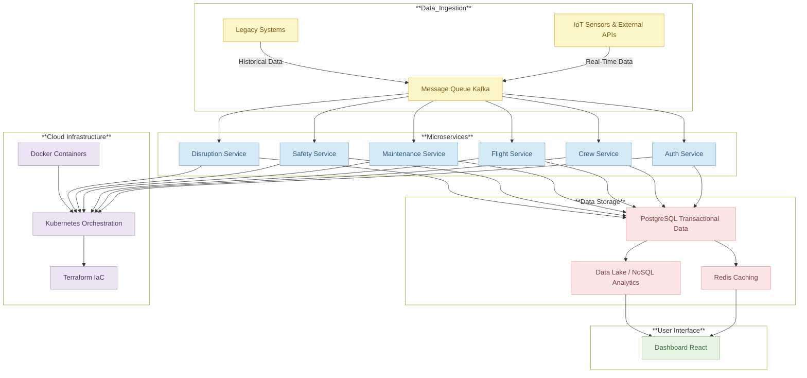

## System Architecture

### Overview
The Unified Crew & Operations Digital Twin System (UCODTS) is a cloud‑native, microservices‑based platform that consolidates all critical airline operations data—covering crew scheduling, flight tracking, predictive maintenance, safety monitoring, and disruption management—into a single digital twin. This architecture is designed for real‑time data ingestion, proactive decision‑making, and scalable analytics, ensuring superior operational efficiency and safety.

### Architectural Components

#### 1. Microservices Design
- **Service Domains:**
  - **Auth Service:**  
    - **Purpose:** Manages user authentication and authorization using industry‑standard protocols (JWT/OAuth).  
  - **Crew Service:**  
    - **Purpose:** Optimizes crew scheduling and predicts fatigue levels by analyzing historical and real‑time data.  
  - **Flight Service:**  
    - **Purpose:** Tracks flight status, monitors delays, and facilitates dynamic route optimization.  
  - **Maintenance Service:**  
    - **Purpose:** Forecasts maintenance needs by integrating IoT sensor data with historical logs.  
  - **Safety Service:**  
    - **Purpose:** Monitors safety incidents, logs events, and supports compliance reporting.  
  - **Disruption Service:**  
    - **Purpose:** Aggregates external data (weather, geopolitical events) to trigger automated re‑routing and emergency protocols.
- **Communication:**  
  - **RESTful APIs:** Synchronous communication between services.
  - **Asynchronous Messaging:** Apache Kafka for low-latency data exchange and resiliency.

#### 2. Data Integration and Storage
- **Real-Time Data Ingestion:**  
  - Data is collected from IoT sensors, external APIs (flight, weather, geopolitical), and legacy systems via a centralized message queue.
- **Storage Architecture:**  
  - **Transactional Layer:** PostgreSQL handles structured, critical data.
  - **Caching Layer:** Redis supports high-speed access to dynamic data.
  - **Analytics Layer:** A data lake (or NoSQL store) preserves historical data for deep analytics and model training.

#### 3. Scalability and Resilience
- **Containerization:**  
  - All microservices are packaged as Docker containers.
- **Orchestration:**  
  - Kubernetes ensures auto-scaling, load balancing, and self-healing deployments.
- **Infrastructure as Code (IaC):**  
  - Terraform scripts automate cloud resource provisioning.
- **Error Handling & Rollback:**  
  - Integrated CI/CD pipelines include automated rollback and disaster recovery procedures to maintain 99.9% uptime.

#### 4. Security and Compliance
- **Zero Trust Architecture:**  
  - All service communications are secured with TLS/SSL and authenticated with JWT/OAuth2.
- **Data Encryption:**  
  - Data is encrypted in transit (TLS) and at rest (AES-256).
- **Compliance:**  
  - System design adheres to GDPR, IATA, and ISO 27001, with regular audits and vulnerability scans.
- **Disaster Recovery:**  
  - Multi-region deployments, regular backups, and documented rollback procedures ensure continuous operation.

#### Visual Diagrams
- **Architecture Diagram:**  
  - Refer to below for a detailed visual representation of the system.
- **Data Flow Diagrams:**  
  - Detailed diagrams illustrate real-time ingestion, processing, and storage pipelines.

### Summary
This architecture provides a robust, scalable, and secure foundation for UCODTS, integrating diverse operational domains into one unified digital twin that supports proactive analytics and real-time decision-making.
