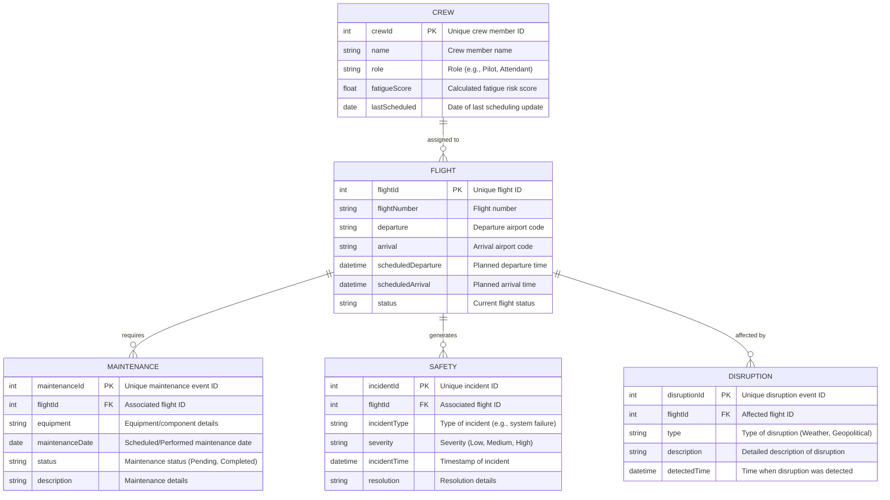

## Data and Analytics Integration

### Overview
This document outlines the data integration strategy for UCODTS, ensuring high data quality, real-time analytics, and continuous improvement of machine learning models. It details our ETL pipelines, data storage architecture, and schema design, including the necessary data model and database diagrams.

### Data Sources and ETL Pipelines
- **Data Sources:**  
  - **Real-Time Feeds:** IoT sensors from aircraft, crew check-in systems, and external APIs (flight status, weather, geopolitical events).
  - **Historical Data:** Past crew schedules, maintenance logs, and safety incident reports.
- **ETL Process:**  
  - **Extract:** Automated extraction of data from all sources.
  - **Transform:** Data cleaning, normalization, and validation using Python scripts.
  - **Load:**  
    - Processed data is loaded into PostgreSQL for transactional needs.
    - Redis is used for caching dynamic data.
    - A data lake (or NoSQL database) stores large volumes of historical data for analytics.
- **Risk Mitigation:**  
  - Automated anomaly detection ensures data consistency.
  - Redundant data sources and caching prevent data loss during peak times.

### Data Model and Schema
- **ERD Diagrams:**  
  - Detailed diagrams illustrate relationships among key entities (crew, flight, maintenance, safety, disruption).
- **Schema Documentation:**  
  - In-depth descriptions of tables, fields, primary and foreign keys, and indexing strategies.
- **ML Model Specifics:**  
  - Documentation of data requirements for training models (e.g., crew fatigue prediction, predictive maintenance).
- **Continuous Improvement:**  
  - Scheduled retraining pipelines and model performance monitoring are in place to ensure ongoing data integrity and model accuracy.

### Analytics Integration
- **Data Pipeline Integration:**  
  - Seamless integration between ETL processes and analytical dashboards.
- **Real-Time Analytics:**  
  - Dashboards (React-based) connected to Redis and PostgreSQL visualize key operational KPIs.
- **Reporting:**  
  - Regular analytics reports monitor performance metrics and trigger model retraining as needed.

### Summary
This document guarantees a robust, scalable, and continuously improving data integration framework for UCODTS, ensuring that our analytics are accurate, actionable, and essential for proactive decision-making.
