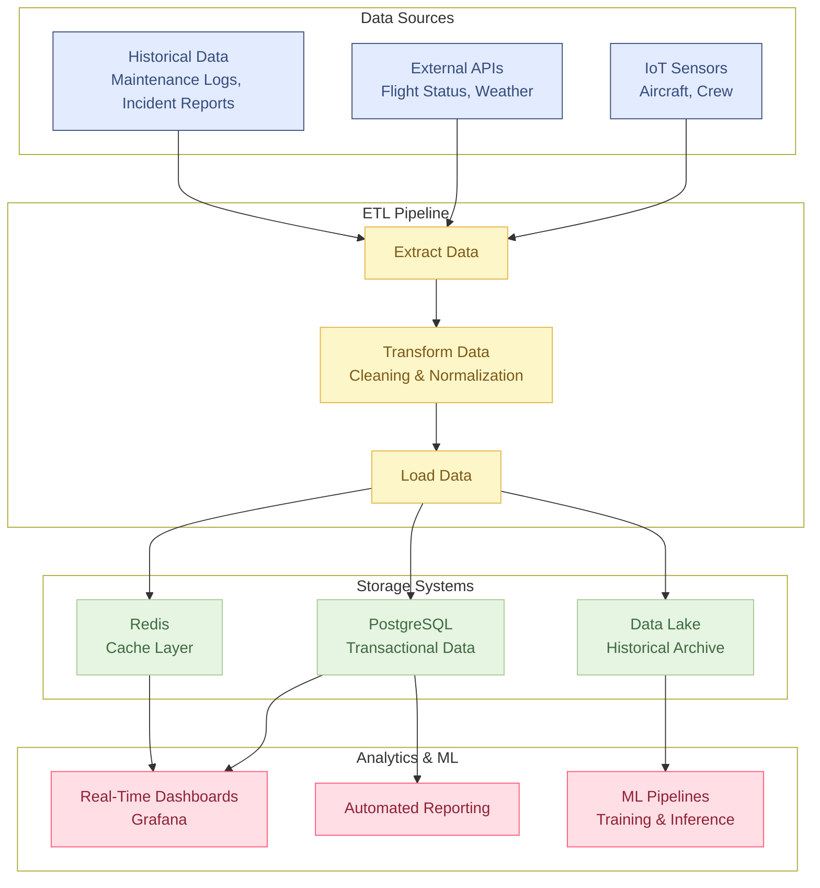
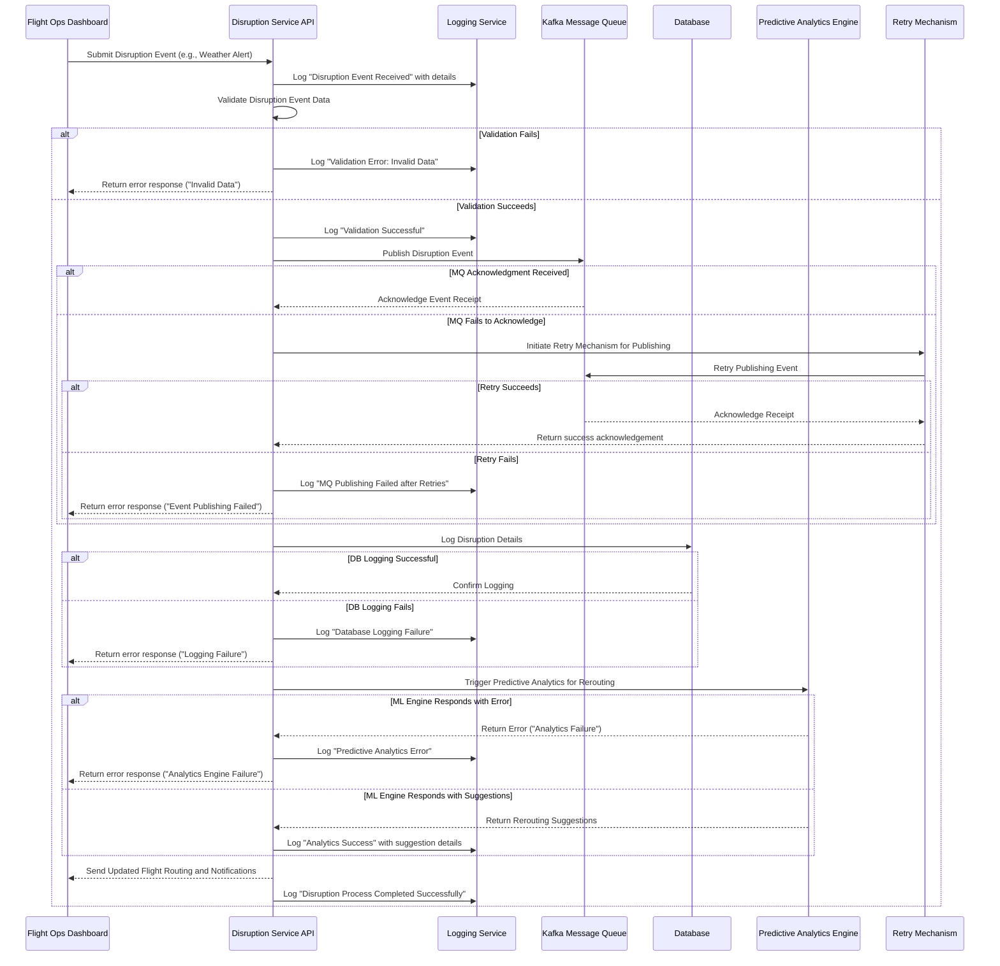

## Data and Analytics Integration

### Overview
This document outlines the data integration strategy for UCODTS, ensuring high data quality, real-time analytics, and continuous improvement of machine learning models. It details our ETL pipelines, data storage architecture, and schema design, including the necessary data model and database diagrams.

### Data Sources and ETL Pipelines
- **Data Sources:**  
  - **Real-Time Feeds:** IoT sensors from aircraft, crew check-in systems, and external APIs (flight status, weather, geopolitical events).
  - **Historical Data:** Past crew schedules, maintenance logs, and safety incident reports.
- **ETL Process:**  
  - **Extract:** Automated extraction of data from all sources.
  - **Transform:** Data cleaning, normalization, and validation using Python scripts.
  - **Load:**  
    - Processed data is loaded into PostgreSQL for transactional needs.
    - Redis is used for caching dynamic data.
    - A data lake (or NoSQL database) stores large volumes of historical data for analytics.
- **Risk Mitigation:**  
  - Automated anomaly detection ensures data consistency.
  - Redundant data sources and caching prevent data loss during peak times.

### Data Model and Schema
- **ERD Diagrams:**  
  - **Crew:** Stores crew profiles, schedules, and fatigue scores.
  - **Flight:** Contains flight details, schedules, statuses, and delay reasons.
  - **Maintenance:** Records maintenance events, statuses, and descriptions.
  - **Safety:** Logs safety incidents, including timestamps and resolutions.
  - **Disruption:** Captures external disruption events and their operational impacts.
- **Schema Documentation:**  
  - Detailed descriptions of tables, fields, primary/foreign keys, and indexing strategies are maintained in our database schema files.
  - ERD diagrams visually represent relationships among key entities.
- **ML Model Specifics:**  
  - Documentation of data requirements for training models (e.g., crew fatigue prediction, predictive maintenance).
- **Continuous Improvement:**  
  - Scheduled updates and retraining pipelines ensure that our ML models remain accurate over time.
  - Continuous monitoring of data quality and pipeline performance, with automated alerts to address issues promptly.

### Schema Documentation
- **Tables and Fields:**
  - Detailed descriptions of each table including primary and foreign keys, data types, and indexing strategies are documented separately in our database schema files. However, its high-level design there can be many more tables and mappings
- **ML Model Specifics:**
  - Data requirements for training models (e.g., crew fatigue prediction, predictive maintenance) are documented, including necessary features, normalization processes, and expected data formats.

- **Data Flow Diagram (DFD):**
The DFD below illustrates the flow of data from its sources through the ETL process to storage and eventual use in analytics and machine learning.

### Analytics Integration
- **Data Pipeline Integration:**  
  - Seamless integration between ETL processes and analytical dashboards.
- **Real-Time Analytics:**  
  - Dashboards (React-based) connected to Redis and PostgreSQL visualize key operational KPIs.
- **Reporting:**  
  - Regular analytics reports monitor performance metrics and trigger model retraining as needed.

### Sequence Diagram

### Summary
This document guarantees a robust, scalable, and continuously improving data integration framework for UCODTS, ensuring that our analytics are accurate, actionable, and essential for proactive decision-making.
